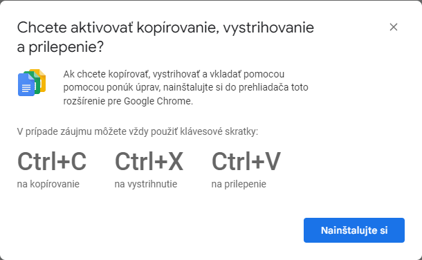
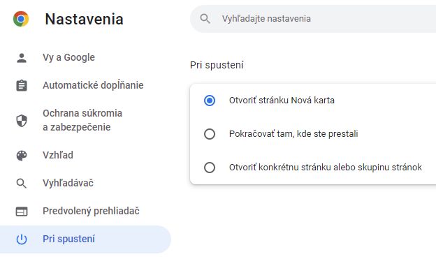
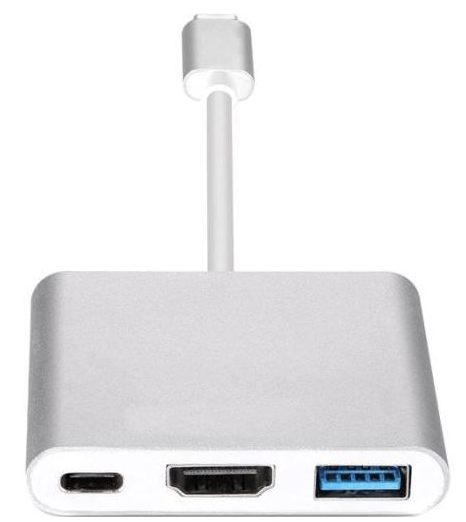
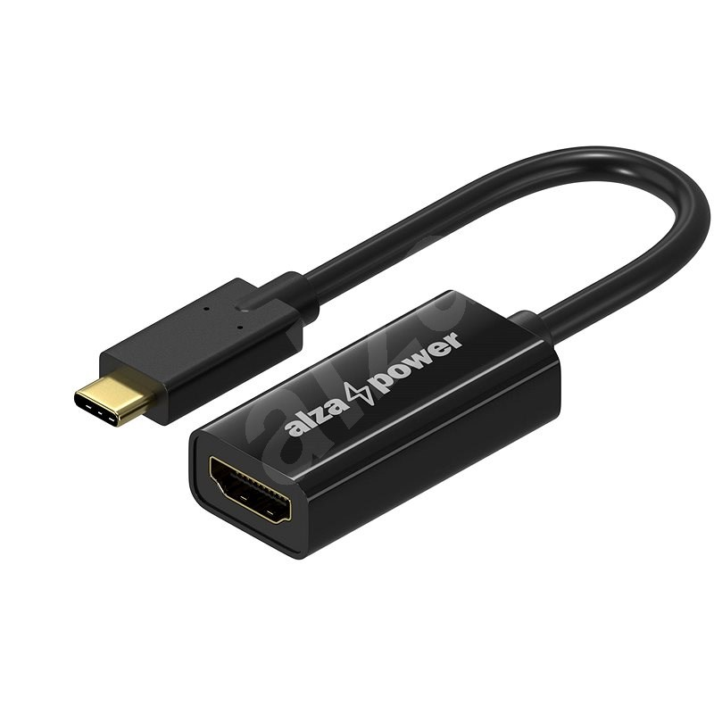
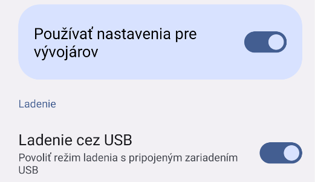

# Metodika ku kurzom počítačovej gramotnosti pre seniorov (S1 – S3)

[TOC]

## Základné princípy

Tieto kurzy sú postavené na úplnej nezávislosti od fyzického zariadenia. Je úplne jedno, či senior používa Windows (10, 11), Linux, Mac OS X. Je jedno, či má nový, alebo starší počítač. Našim cieľom je vybaviť ho zručnosťami, že nech sa posadí za akékoľvek zariadenie pripojené na internet, bude mať k dispozícii všetky svoje e-maily, dokumenty, fotografie, dáta, či nastavenia prehliadača, na ktoré je zvyknutý.

### Teória

Základným princípom predloženej metodiky je sústredenie sa na osvojovanie len tých vedomostí a zručností, ktoré senior naozaj potrebuje a využije pri svojej interakcii s počítačom. Snažíme sa postaviť pevné základy a dosiahnuť to pri čo najnižšej kognitívnej záťaži. To znamená, že z teórie sa senior dozvie len to absolútne nevyhnutné minimum. Tým minimom **nie je** to, z čoho sa skladá počítač, čo je to RAM, SSD, USB a ani to, ako „funguje internet“. **Naopak, tým minimom je pochopenie toho, že svoje dáta má uložené pod svojim účtom v cloude  a je jedno, z akého zariadenia k nim pristupuje.** Na kurze nepracujeme so žiadnymi fyzickými médiami, a to ani s pevným diskom v samotnom počítači – jediná aplikácia, s ktorou pracujeme je internetový prehliadač a miesto, kde má senior **primárne** uložené svoje dáta je cloud, teda jeho **Účet Google**. 

Nevysvetľujeme nič navyše, neukazujeme, čo všetko o počítačoch vieme, ani ak je to zaujímavé (dokonca niekedy ani ak sa na to seniori pýtajú). Každý človek, a senior tiež, má len istú kapacitu, koľko nových informácií a vnemov dokáže prijať za daný čas a preto, ak túto kapacitu naplníme síce zaujímavými, no pre neho neaplikovateľnými vecami, vyčerpáme si ju a nezostane už priestor pre to, čo je naozaj dôležité. 

### Prax

#### Jedno tlačidlo, jeden klik

Praktickú stránku výuky možno zhrnúť do hesla: *„Jedno tlačidlo, jeden klik“*. To znamená, že v prípade práce s PC zručnosti vysvetľujeme spôsobom, pri ktorých senior používa len jedno – primárne tlačidlo myši a len jednoduché kliknutie, teda žiaden „dvojklik“. Ak sme aj zvyknutí na niektoré činnosti používať „opačné“ tlačidlo myši, porozmýšľajme, či to nejde aj bez neho – iným spôsobom. Pri funkcii kopírovania obsahu do schránky používame skratky CTRL + C a CTRL + V, ale ak sú niektorí seniori už naučení používať inú techniku, neodrádzame ich. 

Dôvody pre tieto zásady sú nasledovné:

+ pri kopírovaní cez kontextové menu seniori často presunú kurzor po označení textu na úplne iné miesto  a akcia sa nepodarí,

+ Dokumenty Google vyžadujú nainštalovanie rozšírenia pre kopírovanie a prilepenie obsahu, avšak klávesová skratka funguje vždy,

  

+ niektorí seniori majú kvôli neuro-degeneratívnym zmenám na prstoch problémy používať obe tlačidlá na myši,

+ vyššie uvedené platí aj pre tzv. „dvojklik“, okrem toho, všetky funkcie je možné obslúžiť aj bez neho, ak  senior túto techniku ovláda a nemá s ňou problémy, samozrejme, neodrádzame ho,

+ seniori majú tiež problém rozpoznať, kedy je potrebné „kliknúť dvakrát“, navyše ich počítače často reagujú so značným oneskorením a viacnásobné spúšťanie programu či otváranie novej karty  problém len zhoršuje, 

**Výnimkou z pravidla „jedno tlačidlo, jeden klik“ tvorí skrolovacie koliesko.** Ak seniori v skupine dokážu skrolovať pomocou kolieska bez toho, aby omylom klikali na s ním spojené „prostredné“ tlačidlo myši, túto techniku im vysvetlíme a predcvičíme si ju. Zároveň ich tiež naučíme, čo sa stane, ak koliesko náhodou stlačia príliš silno a ako sa vrátia späť do normálne stavu (**klávesa ESC**).

#### Tri kroky k úspechu

Seniorom pri odovzdaní príručky je potrebné zdôrazniť, ako ju majú používať a rovnako je potrebné postupovať aj pri vysvetľovaní nových zručností počas kurzu. Pri všetkých činnostiach, ktoré vyžadujú vykonávanie viacerých krokov za sebou, prechádzame **pri prvom zoznámení** celú sériu trikrát:

1. Inštruktor predvedie a opisuje každý krok potrebný  na vykonanie akcie, seniori sa len dívajú na projekciu, na konci dostanú priestor na otázky;
2. Inštruktor predvádza akciu znova – seniori si očami sledujú jednotlivé prvky na svojej obrazovke, uvedomujú si, kde sa tieto prvky nachádzajú a poradie jednotlivých krokov, v prípade nejasností porovnávajú čo vidia o seba a čo na projekcii, na konci je priestor na otázky;
3. Pri treťom opakovaní seniori vykonávajú činnosť spolu s inštruktorom alebo samostatne, podľa svojej úrovne.

Podobne postupujú pri používaní príručky. Ak narazia na **červené čísla**, mali by si:

1. Najprv prečítať celú sériu;
2. Pri druhom čítaní si jednotlivé prvky hľadať na obrazovke počítača, uvedomovať si, čo budú robiť a v akom poradí na počítači.
3. Pri treťom čítaní vykonávajú jednotlivé kroky.

Tento spôsob si vyžaduje trpezlivosť a často je potrebné seniorom pripomínať, aby jednotlivé kroky nepredbiehali, ale sústredili sa na čo najpresnejšie vykonanie danej úlohy. Prax ukazuje, že takto sa s najväčšou mierou úspešnosti darí seniorom vykonať požadovanú akciu „na prvý raz“, čo významne zvyšuje ich sebavedomie, ako aj chuť učiť sa ďalšie veci.

*Tou najdôležitejšou devízou je trpezlivosť. Vaša trpezlivosť, trpezlivosť seniorov s vami a v neposlednom rade, trpezlivosť seniorov s nimi samými.* 

#### Čo na školení, to v príručke, doma (a všade)

Aj keď seniori dostávajú príručku vytlačenú, je to dynamický text spracovaný aj v elektronickej podobe v prostredí Moodle. Príručka ku každému kurzu je aktualizovaná niekoľkokrát ročne tak, aby vždy presne odrážala to, čo senior vidí na obrazovke. Text, ako aj snímky obrazovky sedia presne s tým, čo senior vidí na obrazovke počítača a inštrukcie ho pustupne a presne vedú krok za krokom. 

**Prácou s online nástrojmi vytvárame seniorom unifikované prostredie**. Vďaka synchronizácii nastavenia prehliadača cez ich Konto Google čokoľvek, čo urobili na kurze (napríklad zobrazenie panelu so záložkami, pridanie novej záložky, úprava fotografie), sa premietne aj u neho doma a naopak, to, čo spraví doma, sa prejaví po prihlásení aj na počítači v knižnici. Senior nadobúda istotu, že jeho zručnosti sú použiteľné všade a nie sú viazané len na čas a priestor kurzu alebo len na jeho počítač. 

#### Čo učíme a s čím len pomáhame

**„Seniora neučíme nič, čo je potrebné vykonať iba raz.“**

Všetky úkony, ktoré je počas školenia potrebné vykonať len raz (nastavenie prehliadača, nastavenie prostredia Gmailu, obnovenie prístupu k účtu, úprava bezpečnostných nastavení, či nastavenie presmerovania pošty) seniorom pomáhame vykonať (často spoločne), prípadne ich vykonáme za nich, ale v žiadnom prípade ich neučíme a vysvetľujeme len ak majú otázky, aby sa necítili neisto, najmä pokiaľ ide o zmeny ako je presmerovanie pošty a pod.

Našim cieľom je naučenie zručností, u ktorých je predpoklad, že senior ich bude opakovanie používať. Jednorazové činnosti, ku ktorým sa nevráti v priebehu najbližších týždňov, si neosvojí a keď to bude potrebné, nebude ich vedieť použiť. Ani po kurze nebude schopný „všetko spraviť sám“, je pravdepodobné, že prídu okamihy, kedy bude potrebovať pomoc a radu príbuzných – je to úplne normálne.

Rovnako pri oboznamovaní sa s počítačom (napr. nácvik písania, odoslanie prvého e-mailu inštruktorovi za účelom získania adresy pre ďalšiu komunikáciu v rámci kurzu) je vhodné pripraviť seniorom prostredie (otvoriť aplikáciu na písanie a pod.), ak by mu to malo robiť ťažkosti. Vždy sa snažíme, aby všetku energiu a sústredie používal na to, čo je pre neho naozaj užitočné, čo je konkrétnym cieľom danej úlohy a čo je dôvodom, pre ktorý sa učí ju vykonávať. 

Ak teda chcem seniora naučiť písať na klávesnici,  nekombinujem to s učením nájdenia a spustenia programu (ktorý už nikdy potom nepoužije), nastavením veľkosti okna či typu a veľkosti písma. Tieto všetky veci dostane na tanieri, lebo v tejto chvíli sa učí písať písmená s diakritkou, alebo spájať riadky či navigovať sa v texte pomocou kurzora klávesnice.

Naopak, často opakujeme a vedieme seniora k úplnej samostatnosti v činnostiach, ktoré sú bránou ku všetkému ostatnému. 

**Medzi tieto kritické činnosti patria najmä:**

+ otvorenie prehliadača (Google Chrome),

+ bezpečné prihlásenie a bezpečné odhlásenie sa z pošty na ľubovoľnom počítači,gmail

+ pripojenie sa k Wi-Fi sieti (na mobile aj na PC),

+ otvorenie, minimalizovanie, obdnovenie a zatvorenie aplikácie (uvedomenie si, kedy je aplikácia minimalizovaná a kedy je zatvorená),

+ používanie viacerých kariet v prehliadači a schopnosť sa medzi nimi prepínať,

+ funkcia klávesy ESC, klávesová skratka CTRL + Z,

+ schopnosť napísať správne emailovú adresu,

+ vedieť napísať zavináč za každých okolností (vedieť prepnúť jazyk klávenice).

  K týmto činnostiam sa snažíme v nejakej podobe dostať počas kurzu každý deň aspoň raz.

  Až v druhom rade sú ďalšie činnosti ako:

+ prezeranie príloh v emaily,
+ kopírovanie a vkladanie obsahu (CTRL + C, CTRL + V),
+ zdieľanie fotografií v podobe albumov
+ zdieľanie dokumentov.

#### Mastery (majstrovstvo) alebo 100 %

Cieľom týchto je naučiť možno len pár vecí, ale naučiť ich spoľahlivo. Naučiť ich tak, aby sa s nimi senior neoboznámil, ale aby si ich osvojil a aby ich dokázal aplikovať aj po kurze s čo najväčšou mierou istoty a sebavedomia,  či už samostatne, alebo s pomocou príručky. Ktorákoľvek iná informácia, ktorú sa počas kurzu dozvie, neslúži na nič iné než na udržanie pozornosti a záujmu a tak  k nej treba aj pristupovať. Inými slovami, **čo nedokážem naučiť seniora na 100 %, to sa ho nesnažím naučiť vôbec**. 

## Nastavenia pre operačný systém seniora

### Výber operačného systému

Pre účely tohoto kurzu je jedno, ktorý operačný systém senior používa. Ak príde senior s vlastným počítačom, ktorý nemá niektorú s aktuálne podporovaných verzií operačného systému Windows (t. j. **Windows 10** alebo **Windows 11**) a ani nie je možné alebo vhodné pre neho na tento systém svoje zariadenie aktualizovať, vhodnou alternatívou je napríklad na [Ubuntu](https://ubuntu.com/) založený, používateľsky veľmi prívetivý a na systém nenáročný **[Linux Mint v edícii Xfce](https://www.linuxmint.com/edition.php?id=304)**. Tento systém umožňuje inštalácii na kurzu používaného Google Chrome a dobre funguje aj na tých najstarších zariadeniach (procesor musí podporovať 64bitový systém, starším zariadeniam sa už život neoplatí predlžovať, pokiaľ berieme do úvahy ich používanie seniormi). 

Staršie systémy Windows (XP, 7, 8, 8.1) neodporúčame, nakoľko už nie sú aktívne podporované a predovšetkým, používateľa budú so stále väčšou naliehavosťou otravovať s rôznymi hláseniami nabádajúcimi k aktualizácii alebo k iným opatreniam. Senior na tieto požiadavky často nevie reagovať.

### Prostredie 

#### Pracovná plocha (Desktop)

Prostredie je vhodné nastaviť tak, aby v súlade s metodikou nemohlo seniora pri práci pomýliť. V stručnosti to znamená

+ bez ikon na pracovnej ploche;
+ Google Chrome pripnutý na paneli úloh ako jediná ikona;
+ Google Chrome je nastavený ako predvolený prehliadač pre webové stránky, HTML súbory, mailto: odkazy ako aj PDF súbory;

#### Prehliadač

V prehliadači sú dve dôležité nastavenia. Jedným  je mať ako predvolený nastavený **vyhľadávač Google**. Toto je dôležité skontrolovať, pretože najmä na prinesených laptopoch môže byť niektorý zo štandardných vyhľadávačov vymenený nejakým nevhodným rozšírením za stránku, ktorá do výsledkov vyhľadávania vkladá vlastné reklamné odkazy alebo ešte horšie, nepovoleným spôsobom špehuje používateľa či dokonca ťaží kryptomeny. Ak majú seniori skúsenosti s iným typom vyhľadávača (napr. duckduckgo.com), je to samozrejme v poriadku s ním majú skúsenosť a preferujú ho.

Druhým dôležitým nastavením je mať **pri spustení** predvolené tvorenie stránky **Nová karta**. Často používané nastavenie „Pokračovať tam, kde ste prestali“ má rýchlo za následok, že senior má otvorené stále sa zväčšujúce množstvo kariet, ktoré môže veľmi rýchlo spôsobiť významné spomalenie až úplne zamrznutie a pád systému.

## Mobilné zariadenia

### Projekcia

#### Typ projektora a spôsob prenášania obrazu

+ Full HD + 3LCD je lepšia kombinácia ako 4K projektor (napríklad [Epson EB-2250U](https://www.epson.sk/sk_SK/produkty/projektory/in%c5%a1tal%c3%a1cia/eb-2250u/p/21004))
+ miestnosť nemôže byť zatemnená, nakoľko seniori potrebujú vidieť do poznámok, takže projektor by mal mať dostatočnú svietivosť
+ Na projektoroch s menším ako FullHD rozlíšením pre demonštrácia práce s mobilným zariadením problematická

#### Prepojenie mobilného telefónu s projektorom

##### Priame prepojenie s projektorom pomocou kábla

Najjednoduchší spôsob prepojenia je využitie redukcie alebo kábla na priame prepojenie s projektorom. Výhodou je okamžitý a kvalitný prenos obrazu. Nevýhodou je, že pracujeme s vlastným mobilným zariadením a svojimi dátami, čo je však možné na vyriešiť použitím sekundárneho účtu, ktorý umožňujú niektoré zariadenia (pozri 3.1.3.3). 

**Požiadavky:**

+ mobilný telefón s konektorom podporujúcim režim [OTG (USB On-The-Go)](https://mobilizujeme.cz/clanky/jak-zjistit-zda-android-zarizeni-podporuje-funkci-usb-otg). Aplikácia, pre overenie, či váš telefón podporuje OTG sa nazýva [USB OTG Checker](https://play.google.com/store/apps/details?id=com.app.usbotgchecker)
+ vhodný *MHL* OTG adaptér, napríklad USB-C – HDMI (napríklad [kombinovaný](https://www.sunnysoft.sk/z/519PCI-580/adapter-usb-c-na-hdmi-usb-3-0-usb-c-pre-telefony-alebo-notebooky-s-podporou-nabijania-telefonu.html) )

##### Prepojenie prostredníctvom počítača s pomocou kábla (VYSOR – vhodné aj pre iPhone)

Zdarma dostupná aplikácia VYSOR umožňuje efektívne prepojenie prakticky ľubovoľného zariadenia s operačným systémom Android alebo iOS k notebooku s operačným systémom Windows, OS X alebo Linux a dokonca aj priamo bez inštalácie s webovým prehliadačom (Google Chrome alebo Edge). 

**Požiadavky:**

+ [Aplikácia VYSOR](https://www.vysor.io/download/)

+ [VYSOR pre Android](https://play.google.com/store/apps/details?id=com.koushikdutta.vysor&hl=en&gl=US)
+ OTG kábel ja prepojenie s počítačom (USB C – USB A alebo USB C), alebo VYSOR Pro (mesačne 2,5 €, ročne 10 €, jednorázovo 40 €)
+ Aktivované nastavenia pre vývojárov (Developer settings) a Ladenie cez USB  (USB debugging) v mobilnom telefóne

##### Bezdrôtové prepojenie prostredníctvom aplikácie Your Phone (Windows 11 a mobilné telefóny SAMSUNG)
##### Využitie virtuálneho mobilného telefónu (Android Studio)

#### Prispôsobenie mobilného telefónu pre demonštráciu

##### Veľkosť grafických prvkov a písma

##### Zobrazenie dotykov

##### Využívanie alternatívneho profilu (Android 12 okrem telefónov SAMSUNG)

